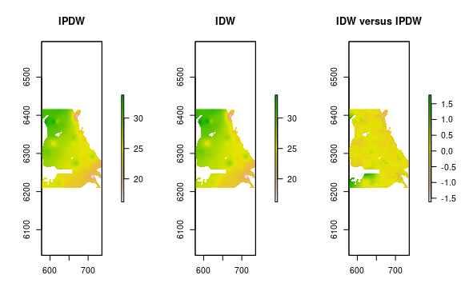
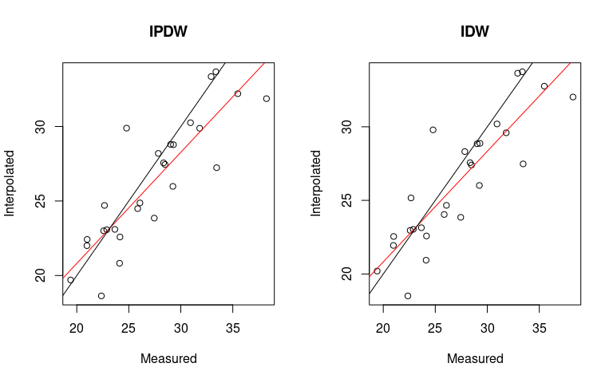

```{r setup, include=FALSE}
knitr::opts_chunk$set(echo = TRUE, fig.pos = 'center', fig.align = 'center')
#, fig.path = "images/"
```

## Introduction

This vignette describes `ipdw`, an `R` package which provides the functionality to perform interpolation of georeferenced point data using inverse path distance weighting [@suominen2010]. Interpolation is accomplished in two steps. First, path distances are calculated from each georeferenced (measurement) point to each prediction point. Path distances, which honor barriers in the landscape, are calculated based on cell-to-cell movement through an underlying  `Raster` object [@hij2014] that represents movement cost. These path distances are subsequently used as interpolation weights. The two-step routine follows the order of operations described in @suominen2010 substituting the ESRI path distance algorithm @mitchell2012 with the `gdistance` [@etten2014] wrapped version of the `igraph` [@csardi2006] adjacency algorithm.

The `ipdw` package was developed with coastal marine applications in mind where path distances (as the fish swims) rather than Euclidean (as the crow flies) distances more accurately represent spatial connectivity [@little1997]. Interpolation of sparse grids in coastal areas otherwise end up bleeding through land areas [@stachelek_application_2015]. The remainder of this vignette provides an example of such a situation using the Kattegat salinity dataset [@diggle2006] found within the `geoR` package.

## Data Preparation

```{r  load_package, message=FALSE, warning=FALSE}
library(ipdw)
```

To begin, we need to load an object representing point observations as either a matrix of coordinates or a `SpatialPointsDataFrame` object and an object representing a coastline as a `SpatialPolygonsDataFrame` object. The data for this demonstration come from a built-in dataset in the `geoR` package for the Kattegat basin of Denmark (see `?geoR::kattegat`). 

```{r load_data, message = FALSE, results='hide'}
library(rgdal)
pols <- readOGR(system.file("extdata/kattegat_coast.gpkg", package = "ipdw"))
pnts <- readOGR(system.file("extdata/kattegat_pnts.gpkg", package = "ipdw"))
```

We can use this `SpatialPolygons` object to create a cost raster defining travel through land areas with a very high cost. As a result, interpolation neighborhoods will be defined based on in-water rather than Euclidean distances. Cost raster creation is accomplished with the `ipdw` function `costrasterGen`. By default, open water areas are set to a per unit travel cost of 1 whereas land areas are set to a per unit travel cost of 10,000. Note that a projection is defined for the `costrasterGen` function by the `projstr` parameter. It is critical to check the resolution of the cost raster before proceeding. The resolution of the cost raster will determine the resolution of the interpolated output. If the resolution is too fine, this will result in very long processing times. If neccesary, coarsen the cost raster with the `raster` function `aggregate`. 

```{r create_costraster}
costras <- costrasterGen(pnts, pols, extent = "pnts", 
												 projstr = projection(pols))
# insert contiguous barrier
costras[160:170,1:80] <- 10000
```

In order to evaulate the utility of IPDW, we split the dataset into seperate training and validation datasets. The training dataset is created in a spatially balanced manner by building a grid and randomly selecting one measurement point per grid cell. In the following code block, the size of this grid is defined as 2 times the average distance among measurement points. Average distance is computed using the `spatstat` package [@bad2005]. Random selection is accomplished with the `gdata` function `resample` [@warn2014]. Subsetting the full dataset is not required to run `ipdw`. Alternative means of estimating interpolation errors, such as leave-one-out cross validation, are in development.

```{r avg_nearest_neigh, message = FALSE}
# find average nearest neighbor
library(spatstat)

W              <- owin(range(coordinates(pnts)[,1]), range(coordinates(pnts)[,2]))
kat.pp         <- ppp(coordinates(pnts)[,1], coordinates(pnts)[,2], window = W)
mean.neighdist <- mean(nndist(kat.pp))

# grid building
gridsize       <- mean.neighdist * 2
grainscale.fac <- gridsize / res(costras)[1]
gridras        <- aggregate(costras, fact = grainscale.fac)
gridpol        <- rasterToPolygons(gridras)
gridpol$value  <- row.names(gridpol)

# spatial join
fulldataset.over    <- over(pnts, gridpol)
fulldataset.over    <- cbind(data.frame(fulldataset.over), 
	setNames(data.frame(pnts), 
	c("id", "salinity", "x.utm", "y.utm", "optional")))

# grid selection
set.seed(2)
gridlev <- unique(fulldataset.over$value)
for(i in seq_along(gridlev)){
  activesub <- subset(fulldataset.over, fulldataset.over$value == gridlev[i])
  selectnum <- gdata::resample(seq_len(nrow(activesub)), 1)
  if(i == 1){
    training <- activesub[selectnum,]
  }
  else{
    training <- rbind(training, activesub[selectnum,])
  }
}
```

Next, we save the training and validation datasets as objects of class `SpatialPointsDataFrame`. Note that the projection of the training and validation datasets matches the cost raster we created previously. Calculations within the `ipdw` package require projected datasets. More about `R` projections can be found from the PROJ.4 documentation at the Open Source Geospatial Foundation (https://trac.osgeo.org/proj/).


```{r split_training_validation}
validate             <- fulldataset.over[!(row.names(fulldataset.over) %in% 
															 	row.names(training)),]
xy                   <- cbind(training$x.utm, training$y.utm)
training             <- SpatialPointsDataFrame(xy, training)
xy                   <- cbind(validate$x.utm, validate$y.utm)
validate             <- SpatialPointsDataFrame(xy, validate)
projection(training) <- projection(pnts)
projection(validate) <- projection(pnts)
```

```{r plot_cost_raster, fig.cap = "<strong>Figure 1: Cost raster representing the high cost of travel through land areas. Training and validation points are shown in black and red respectively.</strong>", fig.height = 6, fig.width = 5}

plot(costras)
points(training)
points(validate, col = "red")
```

## Interpolation

We have assembled an object of class `SpatialPointsDataFrame` to be interpolated and an underlying cost raster of class `Raster`. We can either proceed in a single step using the high-level `ipdw` function `ipdw` or in two steps using calls to the `pathdistGen` and `ipdwInterp` functions. For simplicity, the single step option, `ipdw`, is shown below. The two step option would be useful for the case where we want interpolate multiple parameters of the same `SpatialPointsDataFrame` object using a single `RasterStack` of path distances.


```{r interpolate, cache = FALSE, message = FALSE, results = 'hide'}
paramlist <- c("salinity")
final.ipdw <- ipdw(training, costras, range = mean.neighdist * 10, paramlist,
									 overlapped = TRUE)
```

```{r plot_interpolation, fig.cap = "<strong>Figure 2: Interpolated salinity surface by IPDW.</strong>", fig.height = 6, fig.width = 5}
plot(final.ipdw, main = "Kattegat salinity (ppt)")
```

## Comparison with Inverse Distance Weighting

We can evaluate the benefits of IPDW by comparing its output against Inverse Distance Weighting with Euclidean distances. The following section generates an interpolated surface via IDW. First, prediction points are generated. Then the `gstat` [@peb2004] IDW functionality is called with the same inputs as the previous section above. Differences between the outputs of two methodologies are shown in Figure 2.

```{r create_idw, eval=FALSE}
idw.grid <- rasterToPoints(costras, fun = function(x){ x < 10000}, spatial = TRUE)
gridded(idw.grid) <- TRUE
kat.idw <- gstat::idw(salinity~1, training, idw.grid, maxdist = mean.neighdist*10,
											debug.level = 0)
final.idw <- raster(kat.idw)
```

```{r plot_ipdw_vs_idw, fig.cap = "<strong>Figure 3: Comparison between IPDW and IDW outputs. Note the overestimation of salinity on the upstream (south) side of the contiguous barrier.</strong>", fig.width = 6, fig.height = 4, eval=FALSE}
par(mfrow = c(1, 3), mar = c(5.1, 4.1, 4.1, 5.1))
plot(final.ipdw, main = "IPDW")
plot(final.idw, main = "IDW")
plot(final.idw-final.ipdw,  main = "IDW versus IPDW")
```

```{r plot_ipdw_vs_idw_img, echo=FALSE}

```

We can compare interpolation errors quantitatively using the `errorGen` function. Figure 3 shows a plot of the validation dataset against the interpolated estimates at those points. The validation dataset enters into the function both as a `SpatialPointsDataFrame` object and as the underlying values contained in the data slot.  

```{r generate_validation, eval=FALSE}
measured.spdf              <- data.frame(validate$salinity)
coordinates(measured.spdf) <- coordinates(validate)

valid.ipdw <- errorGen(final.ipdw, measured.spdf, measured.spdf@data)
valid.idw  <- errorGen(final.idw, measured.spdf, measured.spdf@data)
```

```{r plot_validation, fig.cap = "<strong>Figure 4: Comparison between IPDW and IDW interpolation error.  A one-to-one line and best-fit line are shown in black and red respectively.</strong>", fig.width = 8, fig.height = 5, eval=FALSE}
par(mfrow = c(1, 2))
valid.ipdw <- errorGen(final.ipdw, measured.spdf, measured.spdf@data, 
											 plot = TRUE, title = "IPDW")
valid.idw <- errorGen(final.idw, measured.spdf, measured.spdf@data, 
											plot = TRUE, title = "IDW")
```

```{r plot_validation_img, echo=FALSE}

```

Results from IDW and IPDW appear similar because no validation points are present in the area downstream (south) of the contiguous barrier (Figure 1, 2). Up to this point, we have seen a simple implementation of IPDW requiring only a `SpatialPointsDataFrame` and a cost `Raster`. 

Test comparisons between the `ipdw` and the ESRI [@mitchell2012; @suominen2010] implementations of IPDW found `ipdw` to be much faster and more flexible. In particular, the high-level function `ipdw` provides the ability to run IPDW in one step while the lower-level function `ipdwInterp` can be called multiple times following `pathdistGen` in order to interpolate multiple parameters of a single `SpatialPointsDataFrame`. This is accomplished by saving the output from `pathdistGen`.

## References